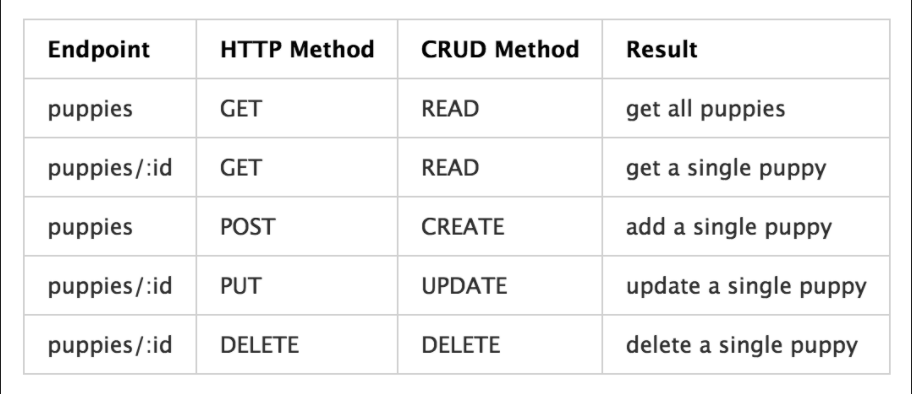

# Intro to Sinatra & MVC

## Objectives

- describe the Model View Controller (MVC) pattern
- define "convention over configuration"
- implement one model < ActiveRecord
- implement one controller
- implement an ERB view
- identify the connection between REST and CRUD

## Questions
- params?
- doctype

## Notes
Model View Controller
- Models - models modify data
- Views html that users interact with
- Controller -connect users, models, and views, through routes/resources
    - parse incoming requests
    - call model methods that create or update data
    - return the appropriate view to the user

CRUD and REST
Create, read, update, delete

### REST
REpresentation State Transfer
1. Client-Server - there is a separation between client and server
2. Stateless - each request contains everything the server needs to understand and process the request
3. Cacheable - data whithin a response to a request can be stored on the client for later retrieval

params -> "parameter"
- the data we send from a form to our controller through an http request
- generally allign with the attributes on our tables
## Icebox

## Images 

### MVC

### REST

